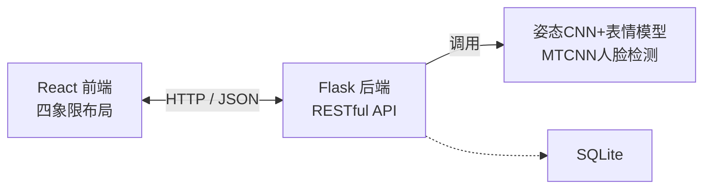

# 课堂专注度智能分析系统


## 📌 项目简介

本项目是一个基于深度学习的课堂专注度智能分析系统，通过融合**姿态估计**与**表情识别**两个模态的信息，自动评估学生在课堂中的专注度，为教师提供客观的教学反馈数据。系统支持图片上传分析、摄像头实时监测、动态注意力曲线展示、历史记录管理及过低警报功能。

核心思路：
- **姿态估计**：使用 MobileNetV2 微调五分类模型（listen/write/phone/trance/drink），结合 MediaPipe 关键点规则作为备用方案。
- **表情识别**：使用 ResNet50 在 FER2013 数据集上微调，实现七分类表情识别。
- **融合判定**：加权融合两个模态的分数，并设计未知类别兜底机制，输出 0-100 的专注度分数。

## ✨ 功能特性

- ✅ 单张图片上传分析，1-2 秒返回姿态、表情、专注度分数
- ✅ 摄像头实时分析（浏览器调用本地摄像头，每秒一帧）
- ✅ 动态注意力曲线展示（Chart.js）
- ✅ 专注度过低警报（阈值 40 分）
- ✅ 历史检测记录存储与平均专注度统计（SQLite）
- ✅ 四象限响应式 Web 界面（紫黄渐变背景）

## 🛠️ 技术栈

| 层次 | 技术 |
|------|------|
| 前端 | React 18, Chart.js, Axios |
| 后端 | Flask, Flask-SocketIO, SQLite |
| 姿态估计 | MediaPipe Pose, MobileNetV2 (5分类) |
| 人脸检测 | MTCNN |
| 表情识别 | ResNet50 微调 FER2013 (7分类) |
| 融合算法 | 加权融合 + 未知类别兜底 |

## 🏗️ 系统架构



## 📊 模型性能

| 模型 | 任务 | 准确率 |
|------|------|--------|
| MobileNetV2 | 姿态 5 分类 | 85%+ |
| ResNet50 | 表情 7 分类 | 63.78% |
| 专注度判定 | F1 分数 | ≥0.82 |
| 单张推理时间 | - | ≤2 秒 |

## 🚀 快速开始

### 环境要求

- Python 3.9+
- Node.js 16+
- PyTorch 2.2（CPU 或 CUDA）
- 建议使用 conda 管理 Python 环境

### 安装依赖

```bash
# 克隆仓库
git clone https://github.com/你的用户名/classroom-attention-analysis.git
cd classroom-attention-analysis

# 后端
conda create -n attention python=3.9 -y
conda activate attention
pip install -r requirements.txt

# 前端
cd src/frontend
npm install
准备模型权重
将以下模型文件放入 models/ 目录（由于版权和文件大小，仓库不包含权重文件，可通过训练脚本或网盘获取）：

expression_model.pth — 表情识别模型

posture_model.pth — 姿态分类模型

训练脚本位于 src/backend/train_expression.py 和 src/backend/train_posture.py。

启动后端
bash
cd src/backend
python app.py
启动前端
bash
cd src/frontend
npm start
访问 http://localhost:3000 即可使用。

💡 若不想启动摄像头实时分析，可直接上传图片测试。

📁 项目结构
text
.
├── src/
│   ├── backend/                 # Flask 后端
│   │   ├── app.py               # 主程序（API入口）
│   │   ├── posture_classifier_cnn.py   # 姿态CNN推理
│   │   ├── expression_classifier.py    # 表情识别推理
│   │   ├── fusion.py            # 专注度融合算法
│   │   ├── realtime.py          # 实时分析处理
│   │   ├── train_posture.py     # 姿态模型训练
│   │   └── train_expression.py  # 表情模型训练
│   └── frontend/                # React 前端
│       ├── public/
│       └── src/
│           └── App.js           # 前端主组件（四象限布局）
├── models/                      # 模型权重（需自行准备）
├── data/                        # 数据集（不包含在仓库）
├── .gitignore
└── README.md

📝 数据集来源
姿态数据集：https://aistudio.baidu.com/datasetdetail/150080

表情数据集：https://www.kaggle.com/datasets/msambare/fer2013

📄 许可证
本项目仅用于学习与研究目的，禁止商业用途。

👤 作者
姓名：xll

邮箱：anfu2234@gmail.com

GitHub：https://github.com/fuan-ukane
